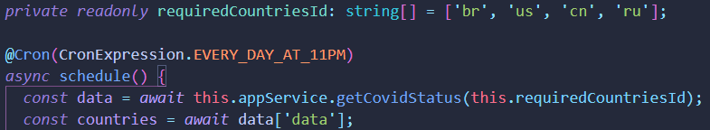
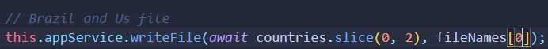
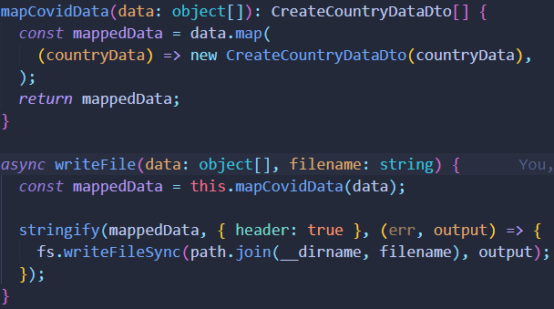
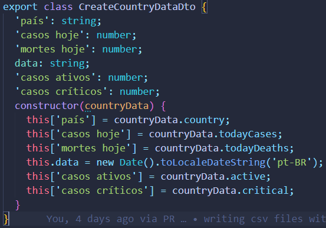
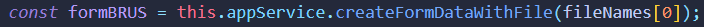
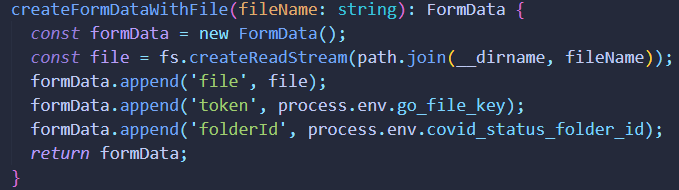
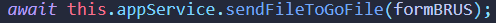
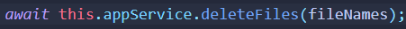
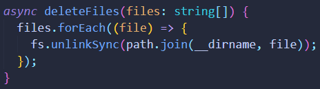

<div align= "center";"><h2>Covid Status Application</h2></div>

<div align= "center"><h2 >Tech used</h2></div>

<div align= "center">


</div>

Application that gets data about covid on some countries from the [disease.sh covid data API](https://disease.sh/docs/#/), treat the data, create csv files locally with a pair of countries and send it to the cloud within the [GoFile](https://gofile.io/welcome), then deletes it locally, as shown by the following image. For more details, keep reading this README.

</div>

```ts
@Cron(CronExpression.EVERY_DAY_AT_11PM)
  async writeFile() {
    const data = await this.appService.getCovidStatus(this.requiredCountriesId);
    const countriesData = await data['data'];
    const files = ['brUsCovidStatus.csv 1', 'cnRuCovidStatus 2'];

    files.forEach((file) => {
      const fileInfo = file.split(' ');
      let countries;
      if (fileInfo[1] === '1') {
        countries = countriesData.slice(0, 2);
      } else {
        countries = countriesData.slice(2, 4);
      }
      this.appService.writeFile(countries, fileInfo[0]);
    });

}

// Five minutes later...
@Cron('0 5 23 1/1 * *')
async sendFilesCloud() {
const files = ['brUsCovidStatus.csv', 'cnRuCovidStatus'];

    files.forEach(async (file) => {
      const form = await this.appService.createFormDataWithFile(file);
      await this.appService.sendFileToGoFile(form);
    });

    await this.appService.deleteFiles(files);

}

```

<center><h2>How it works</h2>
Using Cron from '@nestjs/schedule', I stablish a routine that run every day at 11 PM, following the the order below:
</center>

<center><h2>Getting the data</h2>

First using this method, get the data from the countries with id specified, just as pointed in this [docs](https://disease.sh/docs/#/COVID-19%3A%20Worldometers/get_v3_covid_19_countries__countries_)


</center>

<center><h2>Treating data and writing csv files</h2>

Inside the writeFile method we create map the data so we can add in the csv file as we want, based on the dto, and write it using 'csv-stringify' lib.




</center>

<center>
<h2>Creating form with data.</h2>

Creating FormData because it's the only type of data accepted in the goFile.api for uploading file, using the credentials from my account and inside .env file.



</center>

<center>
<h2>Getting new server and sending file to account on gofile.io</h2>

Now we get a new server and upload our csv file on that server as the [docs](https://gofile.io/api) suggest.




</center>

<center><h2>Deleting the files locally.</h2>

At last, deleting the files locally so doesn't take much memory from our server.

<center></center>


</center>
```
